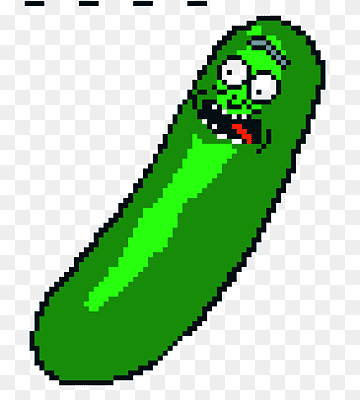

# List of Projects 

## Rick and Morty character visualizer

This is a personal project to practice animations with CSS. It is based on Angular 16, it uses the Rick and Morty API "https://rickandmortyapi.com" to consume resources and information from the show. This website presents each character on a dynamic page as a collectible card on a website with animations.

Status:  FINISHED
