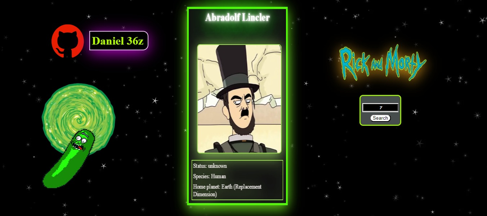
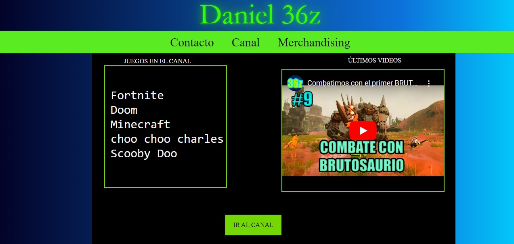

# List of Projects 

## Rick and Morty character visualizer

This is a personal project to practice animations with CSS. It is based on Angular 16, it uses the Rick and Morty API "https://rickandmortyapi.com" to consume resources and information from the show. This website presents each character on a dynamic page as a collectible card on a website with animations.

Status:  FINISHED

#----------------------------------------------------------------------------------------------------------------#

## Web page for YT

this page web is my first project with Js, this is a sample of my gameplay page on YouTube " https://www.youtube.com/channel/UCUlc0s7DuqNLgo66NYYsDkQ " This project can be adapted into a professional page for a content creator who sells merchandise and needs to promote their brand.

Status:  FINISHED (Add responsive content)
